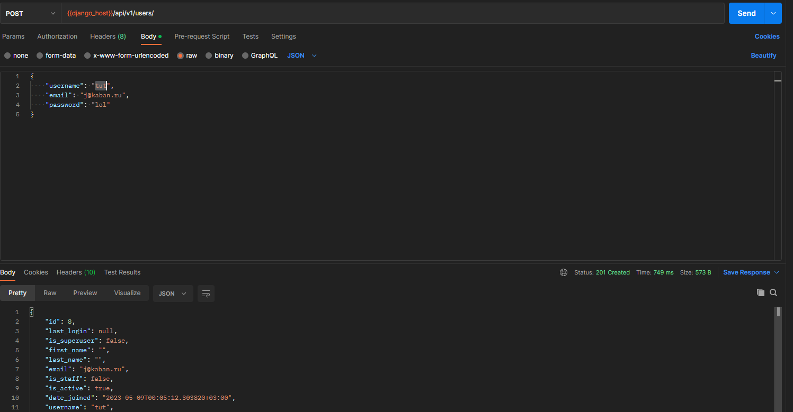
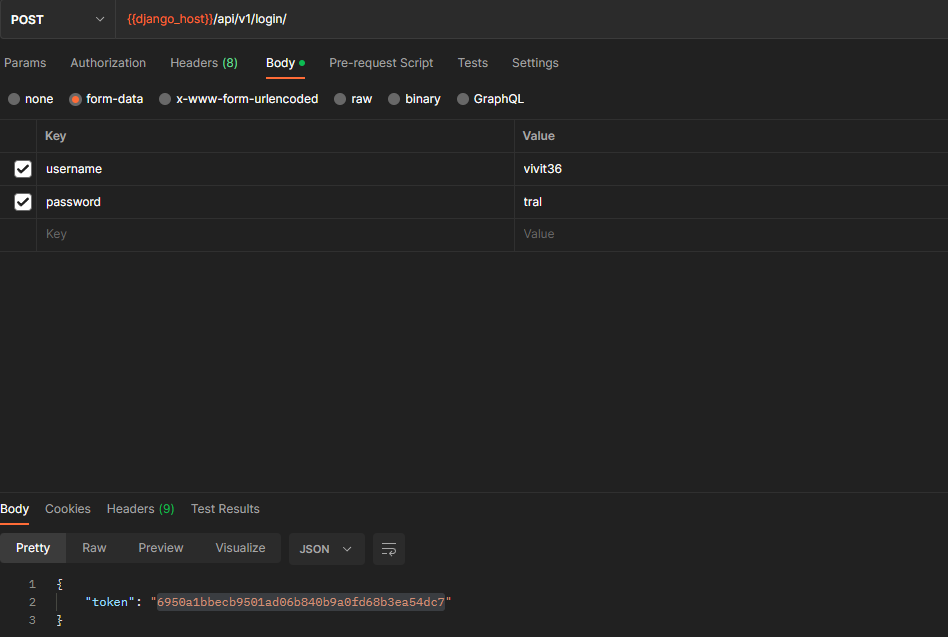
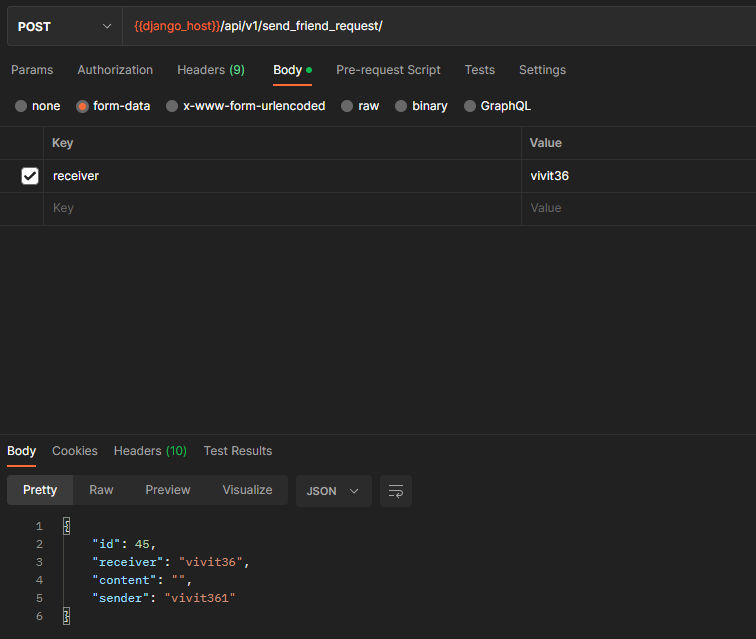
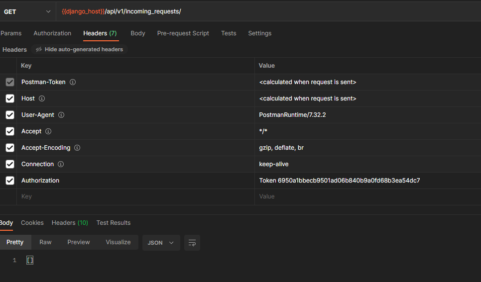
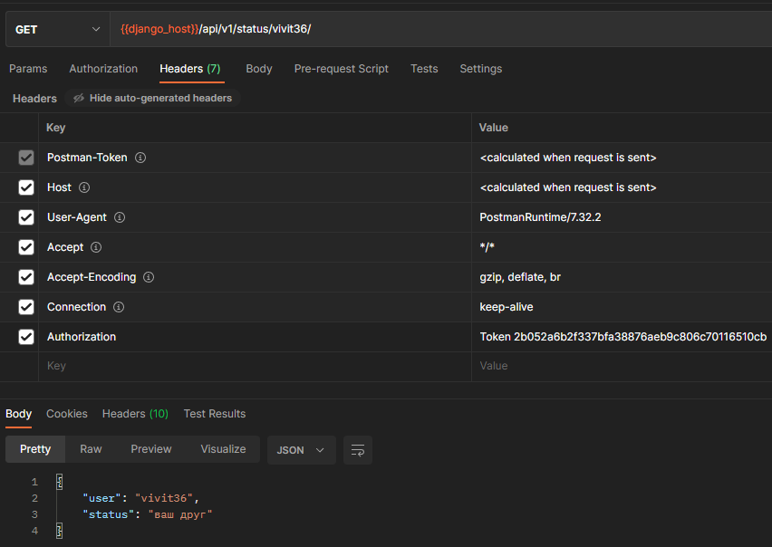
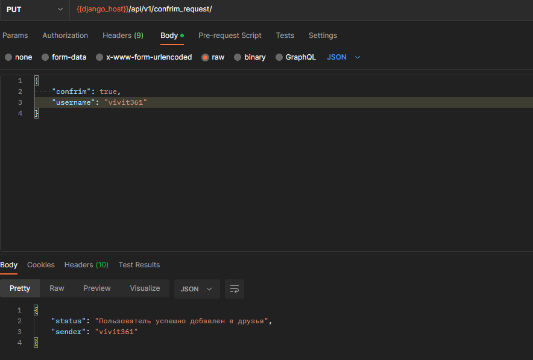
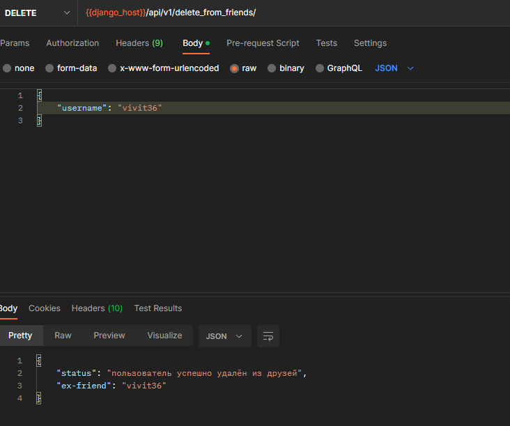

Контактная информация:
Имя: Евгений
tg: @mamihlaapinatapai
телефон: 89880957918

Файл спецификации OpenAPI - [openapi-specification.yml](vktask/openapi-specification.yml)
Также спецификацию можно просмотреть по url: http://127.0.0.1:8000/api/v1/openapi/

Для запуска сервера: python manage.py runserver

Запросы:

(POST)Регистрация пользователя: http://127.0.0.1:8000/api/v1/users/
Для регистрации необходимо передать username и password, также присутствуют опциональные поля
email, last_name, first_name

(POST)Авторизация: http://127.0.0.1:8000/api/v1/login/
Необходимые поля username, password
Возвращается токен, который необходимо затем указвыать в Headers запроса
в поле Authorization (для всех дальнейших запрсов это необходимо)

Пример этого поля в программе Postman:

(POST)Отправить запрос в друзья: http://127.0.0.1:8000/api/v1/send_friend_request/
Необходимые поля: receiver - имя получателя

(GET)Получить входящие запросы в друзья: http://127.0.0.1:8000/api/v1/incoming_requests/

(GET)Получить исходящие запросы в друзья: http://127.0.0.1:8000/api/v1/outgoing_requests/

(GET)Получить список друзей: http://127.0.0.1:8000/api/v1/friends/

(GET)Статус дружбы: http://127.0.0.1:8000/api/v1/status/<имя_пользователя>/

(PUT)Принять/отклонить заявку в друзья: http://127.0.0.1:8000/api/v1/confrim_request/

Принимает обязательные поля username - имя пользователя, на чью заявку отвечаем
confrim - True, если заявка принимается и False, если отказано

(DEL)Удалить из друзей: http://127.0.0.1:8000/api/v1/delete_from_friends/
Принимает обязательное поле username - имя удаляемого пользователя

Примеры использования:

Регистрация 

Авторизация

Запрос в друзья

Входящие запросы (здесь в качестве входных данных показаны Heder'ы вместе с токеном)

Статус дружбы

Принять заявку в друзья

Удаление из друзей

